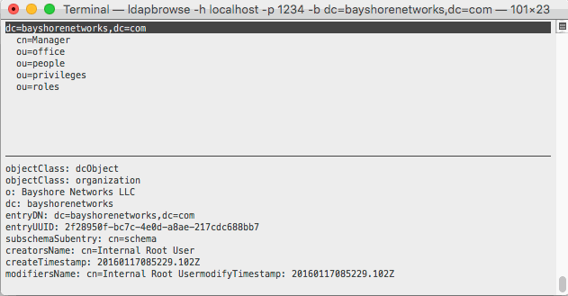

# ldapbrowse 
simple LDAP browser with text user interface

## Usage

The CLI is a subset of [ldapsearch](http://linux.die.net/man/1/ldapsearch):

      ldapbrowse [-H ldapuri] [-D binddn] [-w passwd] [-h ldaphost] [-p ldapport] [-b searchbase] [-a {never|always|search|find}][attributes...]

## Compiling 

    cd src
    make

### dependencies

- ncurses
- libldap
- getopt

## key bindings

`D`: delete selected node 
`s`: save as LDIF

## Wishlist

- editing capabilities (add, edit)
